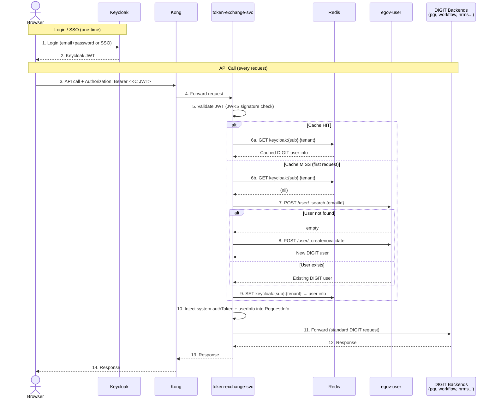

# Keycloak Anti-Corruption Layer for DIGIT Sandbox

**Date**: 2026-03-05
**Status**: Approved
**PRD**: Sandbox Sign Up/Login (Aarushi, v1, 23 Feb 2026)

---

## TL;DR

Add Keycloak in front of DIGIT as a login/SSO layer. A ~200-line Node.js **token-exchange service** sits between Keycloak and DIGIT -- it validates Keycloak JWTs, lazy-provisions DIGIT users, and injects a system token into requests so all 17 DIGIT backend services work unchanged.

**2 new containers** (Keycloak + token-exchange-svc). **0 DIGIT code changes.** SSO signup in 2 clicks.



## Why This Instead of Modifying DIGIT

An alternative approach (KC-001..KC-020 backlog, ~97 SP) proposed modifying `egov-user` to validate Keycloak JWTs directly, adding a persistent sub-mapping table, rewriting `/user/_details`, and doing a full production cutover with canary rollout.

We chose the overlay approach because:

1. **Zero risk to DIGIT internals** -- no patched images, no schema migrations, no new Java code in egov-user. The 6 already-patched DIGIT services (egov-user, egov-workflow-v2, egov-localization, egov-hrms, boundary-service, inbox) don't get touched again.
2. **2-3 days vs 3-4 weeks** -- a standalone Node.js service is faster to build, test, and iterate than modifying a Spring Security OAuth2 stack.
3. **Fully reversible** -- remove 2 containers and revert Kong routes. The alternative requires feature flags, regression testing, and a formal cutover.
4. **Same enforcement** -- Keycloak-only auth can be enforced by removing `/user/oauth/token` from Kong routes. One config line, not a code change.
5. **Graduation path exists** -- if production DIGIT needs a single auth system, the overlay can evolve into the alternative approach. Starting simple doesn't close the door.

---

## Problem

The DIGIT Sandbox signup funnel drops 90% of visitors:
- 100% reach signup page
- 23% proceed to OTP verification
- ~10% complete verification and access the sandbox

Root cause: OTP-based registration requires tab-switching, email/SMS delivery, and a multi-step flow that creates friction for product discovery.

## Objective

- Increase successful account creation from ~10% to 25-40% of visitors
- Reduce median signup time by 50%+

## PRD Features Mapped to Architecture

| PRD Feature | Implementation |
|-------------|---------------|
| 1. Replace OTP with password | Keycloak realm with email+password registration (no OTP) |
| 2. SSO (Google, GitHub, etc.) | Keycloak identity providers (any OIDC/SAML provider) |
| 3. Email as username | Keycloak uses email as primary identifier; adapter maps to DIGIT username |
| 4. Combined signup/login page | Keycloak login theme with email detection (existing vs new user) |

---

## Architecture

### Approach: Kong OIDC + Token Exchange Service

Keycloak handles all user-facing auth. A thin token-exchange service translates Keycloak sessions into DIGIT-native opaque tokens. Zero DIGIT backend services change.

```
┌──────────────┐
│   Browser    │
└──────┬───────┘
       │
       │  1. User clicks "Login" or "Sign up"
       ▼
┌──────────────┐
│  Keycloak    │  Handles: email+password, Google SSO, GitHub SSO, etc.
│  (port 8180) │  Realm: digit-sandbox
│              │  Theme: custom combined login/signup page
└──────┬───────┘
       │
       │  2. Returns JWT (access_token + id_token) to browser
       ▼
┌──────────────┐
│   Browser    │  Stores Keycloak JWT in memory/cookie
└──────┬───────┘
       │
       │  3. API call: Authorization: Bearer <keycloak-jwt>
       ▼
┌──────────────────────────────────────────────────────────────┐
│  Kong (port 18000)                                           │
│                                                              │
│  Route: /auth/*  → proxy to Keycloak (passthrough)           │
│  Route: /pgr-services/*, /mdms-v2/*, etc.                    │
│    → OIDC plugin validates Keycloak JWT                      │
│    → forwards to token-exchange-svc with validated claims     │
│       in X-Userinfo header (base64-encoded)                  │
└──────────────┬───────────────────────────────────────────────┘
               │
               │  4. Validated JWT claims in header
               ▼
┌──────────────────────────────────────────────────────────────┐
│  token-exchange-svc (port 18200)                             │
│  (Node.js/TypeScript, ~200 lines)                            │
│                                                              │
│  For each request:                                           │
│  a. Extract Keycloak subject (sub) from X-Userinfo header    │
│  b. Look up Redis: keycloak:{sub} → digit_opaque_token       │
│  c. If CACHE HIT and token not expired:                      │
│     → Parse request body JSON                                │
│     → Set RequestInfo.authToken = cached DIGIT token         │
│     → Set RequestInfo.userInfo from cached DIGIT user        │
│     → Forward to upstream DIGIT service                      │
│  d. If CACHE MISS:                                           │
│     → Call egov-user _search (by emailId)                    │
│     → If user not found:                                     │
│       → Call egov-user _createnovalidate                     │
│         (name from KC, email as username, CITIZEN role,      │
│          generated password, tenant from request/default)    │
│     → Call egov-user oauth/token (password grant)            │
│       to get DIGIT opaque token                              │
│     → Cache: keycloak:{sub} → {digit_token, digit_user}     │
│       TTL = DIGIT token expiry (7 days)                      │
│     → Rewrite RequestInfo and forward                        │
└──────────────┬───────────────────────────────────────────────┘
               │
               │  5. Standard DIGIT request with opaque authToken
               ▼
┌──────────────────────────────────────────────────────────────┐
│  DIGIT Backend Services (UNCHANGED)                          │
│                                                              │
│  egov-user, pgr-services, egov-workflow-v2, egov-hrms,       │
│  mdms-v2, boundary-service, egov-persister, etc.             │
│                                                              │
│  All see: RequestInfo.authToken = standard DIGIT opaque token│
│  All validate via: egov-user /user/_details endpoint         │
│  Nothing changes.                                            │
└──────────────────────────────────────────────────────────────┘
```

### Why This Works

The anti-corruption boundary is clean:
- **Keycloak world**: JWTs, email-as-username, SSO providers, password policies, login themes
- **DIGIT world**: opaque tokens in Redis, mobile-as-username, OTP flows, BCrypt passwords
- **The bridge**: token-exchange-svc is the ONLY component that knows about both worlds

### What Does NOT Change

| Component | Why unchanged |
|-----------|---------------|
| egov-user | Still stores users, issues tokens, validates tokens. Gets new users via _createnovalidate (existing endpoint) |
| egov-workflow-v2 | Reads authToken from RequestInfo. Doesn't care how it was issued |
| pgr-services | Same |
| egov-hrms | Same |
| mdms-v2 | Same |
| egov-persister | Consumes Kafka events. No auth involvement |
| boundary-service | Same pattern as other services |
| egov-accesscontrol | Role checks use DIGIT user roles. Token-exchange ensures DIGIT user has correct roles |
| egov-enc-service | Encrypts/decrypts data. No auth involvement |
| Redis | Already used by egov-user for token storage. token-exchange-svc adds a small cache namespace (keycloak:*) |

---

## New Components

### 1. Keycloak Container

```yaml
keycloak:
  image: quay.io/keycloak/keycloak:24.0
  command: start-dev --import-realm
  environment:
    KC_DB: postgres
    KC_DB_URL: jdbc:postgresql://postgres:5432/keycloak
    KC_DB_USERNAME: egov
    KC_DB_PASSWORD: egov
    KC_HOSTNAME_STRICT: "false"
    KC_HTTP_ENABLED: "true"
    KC_HTTP_PORT: 8180
    KC_PROXY_HEADERS: xforwarded
    KEYCLOAK_ADMIN: admin
    KEYCLOAK_ADMIN_PASSWORD: admin
  volumes:
    - ./keycloak/realm-export.json:/opt/keycloak/data/import/realm-export.json:ro
    - ./keycloak/themes/digit-sandbox:/opt/keycloak/themes/digit-sandbox:ro
  ports:
    - "18180:8180"
  networks:
    egov-network:
```

**Database**: Separate `keycloak` database in the same PostgreSQL instance (created via init script or separate DB container). Keycloak manages its own schema via Liquibase.

**Realm config** (`keycloak/realm-export.json`):
- Realm name: `digit-sandbox`
- Login settings: registration enabled, email as username, verify email disabled (for sandbox)
- Password policy: minLength(8)
- Identity providers: Google, GitHub, Microsoft (configurable via env vars for client ID/secret)
- Client: `digit-sandbox-ui` (public client, authorization code flow + PKCE)
- Default roles: `sandbox-user`
- Token settings: access token lifespan = 1 hour, refresh = 7 days

### 2. Token Exchange Service

```yaml
token-exchange-svc:
  image: node:22-alpine
  working_dir: /app
  command: node server.js
  environment:
    DIGIT_USER_HOST: http://egov-user:8107
    DIGIT_SYSTEM_USERNAME: INTERNAL_MICROSERVICE_ROLE
    DIGIT_SYSTEM_PASSWORD: eGov@123
    DIGIT_SYSTEM_TENANT: pg
    DIGIT_DEFAULT_TENANT: pg.citya
    KEYCLOAK_ISSUER: http://keycloak:8180/realms/digit-sandbox
    KEYCLOAK_JWKS_URI: http://keycloak:8180/realms/digit-sandbox/protocol/openid-connect/certs
    REDIS_HOST: redis
    REDIS_PORT: 6379
    CACHE_PREFIX: keycloak
    CACHE_TTL_SECONDS: 604800  # 7 days
    UPSTREAM_SERVICES: |
      pgr-services:8082,
      egov-workflow-v2:8109,
      mdms-v2:8094,
      egov-hrms:8098,
      boundary-service:8081,
      egov-filestore:8084,
      egov-idgen:8088,
      egov-localization:8096,
      egov-accesscontrol:8090,
      egov-indexer:8095,
      inbox:8097
  volumes:
    - ./token-exchange/:/app:ro
  ports:
    - "18200:3000"
  depends_on:
    - egov-user
    - redis
  networks:
    egov-network:
```

**Implementation** (~200 lines TypeScript):

```
token-exchange/
├── server.ts          # Express server, single middleware
├── digit-client.ts    # egov-user API calls (search, create, login)
├── cache.ts           # Redis get/set with TTL
├── types.ts           # Keycloak claims, DIGIT token types
└── package.json
```

**Core logic (pseudocode)**:

```typescript
// At startup: authenticate as system user, cache the system token
let systemToken: string;
async function initSystemToken() {
  const resp = await digitClient.login({
    username: "INTERNAL_MICROSERVICE_ROLE",
    password: systemPassword,
    tenantId: "pg",
    userType: "SYSTEM",
  });
  systemToken = resp.access_token;
  // Refresh periodically (every 6 days, token valid for 7)
}

// Per-request: resolve Keycloak user → DIGIT user
async function resolveUser(kcClaims: KCClaims, tenantId: string): Promise<DigitUser> {
  const cacheKey = `keycloak:${kcClaims.sub}:${tenantId}`;

  // 1. Check cache
  const cached = await redis.get(cacheKey);
  if (cached) {
    // Sync check: compare KC name/email with cached DIGIT user
    if (cached.name !== kcClaims.name || cached.email !== kcClaims.email) {
      await digitClient.updateUser(cached.uuid, { name: kcClaims.name, emailId: kcClaims.email });
      cached.name = kcClaims.name;
      cached.email = kcClaims.email;
      await redis.set(cacheKey, cached, CACHE_TTL);
    }
    return cached;
  }

  // 2. Search for existing DIGIT user by email
  let digitUser = await digitClient.searchUser({
    emailId: kcClaims.email,
    tenantId,
  });

  // 3. Lazy provision if not found
  if (!digitUser) {
    const mobileHash = parseInt(sha256(kcClaims.sub).slice(0, 5), 16) % 100000;
    digitUser = await digitClient.createUser({
      name: kcClaims.name || kcClaims.preferred_username,
      userName: kcClaims.email,
      emailId: kcClaims.email,
      mobileNumber: `90000${String(mobileHash).padStart(5, "0")}`,
      password: randomBytes(32).toString("hex"), // random, never used again
      tenantId,
      type: "CITIZEN",
      roles: [{ code: "CITIZEN", name: "Citizen" }],
    });
  }

  // 4. Cache and return (no per-user token needed -- system token is used)
  const userInfo = { uuid: digitUser.uuid, userName: digitUser.userName,
    name: digitUser.name, email: digitUser.emailId, tenantId, type: "CITIZEN",
    roles: digitUser.roles };
  await redis.set(cacheKey, userInfo, CACHE_TTL);
  return userInfo;
}
```

**Request handling (content-type aware)**:

```typescript
app.use("*", async (req, res) => {
  // 1. Validate Keycloak JWT (JWKS signature check)
  const kcClaims = await validateJWT(req.headers.authorization);
  if (!kcClaims) return res.status(401).json({ error: "Invalid token" });

  const contentType = req.headers["content-type"] || "";

  if (contentType.includes("application/json")) {
    // JSON body: parse, inject system token + user info, re-serialize
    const body = req.body;
    const tenantId = body?.RequestInfo?.userInfo?.tenantId
      || body?.tenantId || DEFAULT_TENANT;
    const digitUser = await resolveUser(kcClaims, tenantId);

    body.RequestInfo = body.RequestInfo || {};
    body.RequestInfo.authToken = systemToken;
    body.RequestInfo.userInfo = digitUser;

    const upstream = resolveUpstream(req.path);
    const response = await fetch(upstream, {
      method: req.method, body: JSON.stringify(body),
      headers: { "Content-Type": "application/json" },
    });
    res.status(response.status).json(await response.json());

  } else if (contentType.includes("multipart/form-data")) {
    // File uploads: pass system token via query param, stream body untouched
    const upstream = resolveUpstream(req.path);
    const url = `${upstream}?auth-token=${systemToken}`;
    req.pipe(request(url)).pipe(res);

  } else {
    // Other content types: pass-through with auth header
    const upstream = resolveUpstream(req.path);
    req.pipe(request({ url: upstream, headers: { Authorization: `Bearer ${systemToken}` } })).pipe(res);
  }
});
```

### 3. Kong OIDC Plugin Configuration

Added to `kong/kong.yml`:

```yaml
plugins:
  - name: openid-connect  # Kong OIDC plugin (kong-oidc or similar)
    config:
      issuer: http://keycloak:8180/realms/digit-sandbox
      client_id: digit-sandbox-ui
      redirect_uri: /callback
      scope: openid email profile
      token_header: Authorization
      consumer_claim: sub
      verify_signature: true
      # Pass validated claims to upstream
      upstream_headers:
        userinfo: X-Userinfo
        access_token: X-Access-Token

# New routes
services:
  - name: keycloak
    url: http://keycloak:8180
    routes:
      - name: keycloak-auth
        paths:
          - /auth
        strip_path: false
        # No OIDC plugin here -- passthrough to Keycloak

  - name: token-exchange
    url: http://token-exchange-svc:3000
    routes:
      - name: digit-api-with-auth
        paths:
          - /pgr-services
          - /mdms-v2
          - /egov-workflow-v2
          # ... all DIGIT API routes
        plugins:
          - name: openid-connect  # validates JWT before forwarding
```

**Note on Kong OIDC**: The open-source Kong doesn't include an OIDC plugin. Options:
1. Use `kong-oidc` community plugin (Lua, well-maintained)
2. Use `kong/lua-resty-openidc` directly
3. Switch to Kong Gateway (Enterprise) which includes OIDC natively
4. Skip Kong OIDC entirely -- let the token-exchange-svc validate JWTs itself using `jose` library

Option 4 is simplest for the local tilt-demo stack. Kong routes to token-exchange-svc, which validates the Keycloak JWT directly. No Kong plugin needed.

### Revised Flow (Option 4 -- no Kong OIDC plugin)

```
Browser → Kong → token-exchange-svc (validates JWT + exchanges token) → DIGIT backends
```

Kong config change is minimal -- just route DIGIT API paths to token-exchange-svc instead of directly to backends:

```yaml
# BEFORE (current):
- name: pgr-service
  url: http://pgr-services:8082
  routes:
    - paths: ["/pgr-services"]

# AFTER:
- name: pgr-service
  url: http://token-exchange-svc:3000
  routes:
    - paths: ["/pgr-services"]
```

The token-exchange-svc reads the `Authorization: Bearer <keycloak-jwt>` header, validates it against Keycloak's JWKS endpoint (`/realms/digit-sandbox/protocol/openid-connect/certs`), performs the exchange, and proxies to the real upstream.

---

## User Flows

### Flow 1: Email + Password Signup (New User)

```
1. User visits sandbox landing page
2. Clicks "Get Started" → redirected to Keycloak login page
3. Keycloak login page shows email field
4. User enters email → Keycloak checks if account exists
   - If new: shows "Create Account" form (name, email, password)
   - If existing: shows "Welcome back" form (password field)
5. User fills form and submits
6. Keycloak creates account, issues JWT
7. Browser receives JWT, redirects to sandbox
8. First API call: token-exchange-svc provisions DIGIT user + gets DIGIT token
9. User is in the sandbox
```

**Steps for user**: 3 (enter email, fill form, submit). No OTP. No tab switching.

### Flow 2: Google/GitHub SSO (New User)

```
1. User visits sandbox landing page
2. Clicks "Get Started" → redirected to Keycloak login page
3. Clicks "Continue with Google" (or GitHub, Microsoft)
4. Google OAuth consent screen → user approves
5. Keycloak receives Google token, creates/links account
6. Keycloak issues JWT
7. Browser receives JWT, redirects to sandbox
8. First API call: token-exchange-svc provisions DIGIT user
9. User is in the sandbox
```

**Steps for user**: 2 clicks (Get Started + Continue with Google).

### Flow 3: Returning User (Email + Password)

```
1. User visits sandbox → clicks "Login"
2. Keycloak login page → enters email + password
3. Keycloak validates, issues JWT
4. token-exchange-svc finds cached DIGIT token (or re-issues)
5. User is in the sandbox
```

### Flow 4: Returning User (SSO)

```
1. User visits sandbox → clicks "Login"
2. Clicks "Continue with Google"
3. Already signed into Google → auto-redirects back
4. Done in 2 clicks
```

---

## Data Model

### Keycloak User (managed by Keycloak)

| Field | Source | Example |
|-------|--------|---------|
| sub | Keycloak UUID | `a1b2c3d4-...` |
| email | User input or SSO | `john@gmail.com` |
| name | User input or SSO | `John Doe` |
| preferred_username | = email | `john@gmail.com` |
| email_verified | true for SSO, false for email+password (no verification in sandbox) | `true` |
| identity_provider | SSO provider name | `google`, `github`, null for email+password |

### DIGIT User (created by token-exchange-svc via _createnovalidate)

| Field | Value | Notes |
|-------|-------|-------|
| userName | Keycloak email | e.g., `john@gmail.com` |
| name | Keycloak name | e.g., `John Doe` |
| emailId | Keycloak email | Same as userName |
| mobileNumber | `9999900000` (placeholder) | DIGIT requires this field; not available from SSO |
| password | Generated or fixed sandbox password | User never sees this; only token-exchange-svc uses it |
| tenantId | `pg.citya` (default) | Configurable |
| type | `CITIZEN` | All sandbox users are citizens |
| roles | `[{code: "CITIZEN"}]` | Basic role |
| active | `true` | |

### Redis Cache Entry

```
Key:   keycloak:{keycloak_sub_uuid}
Value: {
  digit_token: "opaque-token-from-egov-user",
  digit_user: { uuid, userName, tenantId, roles, type },
  created_at: 1741200000,
  expires_at: 1741804800
}
TTL:   7 days (matches DIGIT token expiry)
```

---

## Edge Cases

| Scenario | Handling |
|----------|----------|
| Keycloak JWT expired but DIGIT token still valid | token-exchange-svc never sees the request -- Keycloak JS adapter in browser refreshes JWT before API call |
| DIGIT token expired but Keycloak JWT still valid | Cache miss → re-issue DIGIT token via oauth/token |
| User exists in DIGIT but not Keycloak | Not possible -- Keycloak is the only signup path. Legacy users would need migration (out of scope for sandbox) |
| User exists in Keycloak but DIGIT user was deleted | token-exchange-svc re-provisions via _createnovalidate |
| Same email, different SSO providers | Keycloak handles account linking natively. One Keycloak user → one DIGIT user |
| Mobile number required by DIGIT but not provided by SSO | Placeholder `9999900000`. Could add optional phone field to Keycloak registration form later |
| DIGIT _createnovalidate fails (duplicate username) | Email already exists in DIGIT. Search for existing user, get token for them instead |
| Rate limiting | Keycloak has built-in brute force protection. Kong rate limiting stays as-is |

---

## Docker Compose Changes

New containers added to `docker-compose.deploy.yaml`:

| Container | Image | Port | Depends On |
|-----------|-------|------|------------|
| keycloak | quay.io/keycloak/keycloak:24.0 | 18180 | postgres-db |
| token-exchange-svc | node:22-alpine | 18200 | egov-user, redis, keycloak |

PostgreSQL change: Add `keycloak` database via init script (Keycloak manages its own schema).

Kong change: Re-route DIGIT API paths from direct backend URLs to token-exchange-svc.

### New Files

```
tilt-demo/
├── keycloak/
│   ├── realm-export.json        # digit-sandbox realm config
│   └── themes/
│       └── digit-sandbox/       # Custom login theme (combined signup/login)
│           └── login/
│               ├── theme.properties
│               ├── login.ftl     # FreeMarker template
│               └── resources/
│                   └── css/
│                       └── login.css
├── token-exchange/
│   ├── package.json
│   ├── tsconfig.json
│   ├── server.ts
│   ├── digit-client.ts
│   ├── cache.ts
│   └── types.ts
└── db/
    └── keycloak-init.sql        # CREATE DATABASE keycloak
```

---

## What Changes Per Component (Summary)

| Component | Change | Scope |
|-----------|--------|-------|
| **docker-compose.deploy.yaml** | Add keycloak + token-exchange-svc containers | ~40 lines |
| **kong/kong.yml** | Re-route DIGIT API paths to token-exchange-svc; add /auth route to Keycloak | ~20 lines changed |
| **db/ (postgres init)** | Add keycloak database creation | 1 SQL file, ~3 lines |
| **keycloak/ (new)** | Realm export JSON + custom login theme | ~2 files + theme assets |
| **token-exchange/ (new)** | Node.js/TS token exchange service | ~4 source files, ~200 lines |
| **Frontend (digit-ui)** | Replace DIGIT login with Keycloak redirect | Auth module change |
| **egov-user** | NO CHANGE | - |
| **egov-workflow-v2** | NO CHANGE | - |
| **pgr-services** | NO CHANGE | - |
| **egov-hrms** | NO CHANGE | - |
| **mdms-v2** | NO CHANGE | - |
| **boundary-service** | NO CHANGE | - |
| **egov-persister** | NO CHANGE | - |
| **egov-accesscontrol** | NO CHANGE | - |
| **egov-enc-service** | NO CHANGE | - |
| **egov-filestore** | NO CHANGE | - |
| **egov-idgen** | NO CHANGE | - |
| **egov-localization** | NO CHANGE | - |
| **egov-indexer** | NO CHANGE | - |
| **inbox** | NO CHANGE | - |
| **egov-bndry-mgmnt** | NO CHANGE | - |
| **default-data-handler** | NO CHANGE | - |
| **Redis** | NO CHANGE (shared, new key namespace) | - |
| **Redpanda/Kafka** | NO CHANGE | - |
| **Elasticsearch** | NO CHANGE | - |
| **MinIO** | NO CHANGE | - |
| **OTEL/Grafana/Tempo** | NO CHANGE (token-exchange-svc can emit traces optionally) | - |
| **Gatus** | Add Keycloak + token-exchange health checks | ~10 lines |

---

## Known Downsides and Mitigations

### 1. Shadow Password Problem → MITIGATED: System Token

~~Every provisioned DIGIT user needs a password for oauth/token.~~

**Mitigation**: token-exchange-svc authenticates once as the INTERNAL_MICROSERVICE_ROLE system user (already exists in the stack). Uses the system token for all forwarded requests. The real user's identity is injected into `RequestInfo.userInfo`. No per-user DIGIT passwords needed at all. This mirrors how DIGIT's own internal service-to-service calls work.

### 2. Dual User Store Drift → MITIGATED: Sync on Request

Users exist in both Keycloak and egov-user. Changes in one don't propagate to the other.

**Mitigation**: On every request, token-exchange-svc compares Keycloak JWT claims (name, email) with the cached DIGIT user profile. If they differ, calls `_updatenovalidate` to sync the DIGIT record. This is a cheap string comparison per request with an occasional write.

### 3. No Revocation Propagation → MITIGATED: Short-lived JWTs

Banning a user in Keycloak doesn't invalidate cached sessions.

**Mitigation**: Keycloak access token lifespan set to 5-15 minutes with refresh token rotation. The browser's Keycloak JS adapter silently refreshes. When a user is banned, the next refresh fails within minutes. token-exchange-svc validates the JWT on every request -- expired/invalid JWTs are rejected before reaching DIGIT.

### 4. RequestInfo Body Rewriting → MITIGATED: Content-type Aware Proxy

The proxy must parse JSON bodies to inject authToken/userInfo. Breaks for multipart uploads.

**Mitigation**: Content-type-aware handling:
- `application/json` bodies → parse, inject `RequestInfo.authToken` + `RequestInfo.userInfo`, re-serialize, forward
- `multipart/form-data` (file uploads to egov-filestore) → pass system token via query parameter (`?auth-token=...`), which egov-filestore already supports. Don't touch the multipart body.
- All other content types → pass-through with auth header

### 5. Single Point of Failure → MITIGATED: Standard Ops

token-exchange-svc sits in the hot path of every API call.

**Mitigation**:
- `restart: always` in docker-compose
- Health check endpoint (`/healthz`) validating Redis + Keycloak JWKS reachability
- Service is stateless -- Redis is the only state. Can scale horizontally behind Kong
- Graceful degradation: if Redis is down, fall back to per-request JWT validation + fresh DIGIT user lookup (slower but functional)

### 6. First-Request Latency → ACCEPTED

First request for a new user adds ~100-300ms (JWT validation → user search → maybe create user → cache). With system token approach, no per-user oauth/token call needed. Subsequent requests are cache hits (~5-10ms overhead).

**Accepted**: Imperceptible for a sandbox. No mitigation needed.

### 7. Mobile Number Placeholder → MITIGATED: Hash-derived Unique Numbers

DIGIT requires `mobileNumber`. SSO providers don't provide one.

**Mitigation**: Generate a unique mobile number per user: `90000XXXXX` where `XXXXX` is derived from a hash of the Keycloak subject UUID (e.g., `parseInt(sha256(sub).slice(0,5), 16) % 100000`). Guaranteed unique per user. Satisfies DIGIT's field requirement. No real SMS goes to these numbers.

### 8. Tenant Ambiguity → MITIGATED: Extract from Request

Design can't hardcode a single tenant for multi-tenant sandboxes.

**Mitigation**: Read `tenantId` from the API request body (all DIGIT API calls include it). On first request, provision the DIGIT user in whatever tenant the request targets. Cache maps `keycloak:{sub}:{tenantId}` → DIGIT session. If the user calls a different tenant later, a new DIGIT user/role is provisioned for that tenant.

---

## Security Considerations

- **Keycloak JWT validation**: token-exchange-svc validates JWT signature against Keycloak JWKS (RS256). No shared secret.
- **System token**: token-exchange-svc uses INTERNAL_MICROSERVICE_ROLE system account. No per-user passwords stored.
- **CORS**: Keycloak and Kong both need CORS config for the frontend origin.
- **PKCE**: Keycloak client uses Authorization Code + PKCE (no client secret in browser).
- **Token leakage**: DIGIT opaque tokens are only in server-side cache + backend calls. Browser only ever sees Keycloak JWT.
- **Short-lived JWTs**: 5-15 minute access token lifespan limits exposure window for compromised tokens.

---

## Migration Path (Sandbox → Production)

For production DIGIT deployments (beyond sandbox):
1. Enable email verification in Keycloak
2. Add phone number collection to Keycloak registration form (replace hash-derived placeholders)
3. Consider Keycloak User Federation SPI to read/write DIGIT user tables directly (eliminates dual user store)
4. Add proper Keycloak admin UI access controls
5. Move to colleague's KC-004..KC-006 approach if single auth system is required

---

## Enforcing Keycloak-Only Auth

To make Keycloak the sole login path (optional), remove these routes from `kong/kong.yml`:

```yaml
# Remove to block direct egov-user login:
- /user/oauth/token        # OAuth2 password grant (direct login)
- /user/citizen/_create    # OTP-based citizen registration
```

Keep these routes (needed by token-exchange-svc internally, not exposed via Kong):
- `/user/users/_createnovalidate` (user provisioning)
- `/user/_search` (user lookup)
- `/user/_details` (token validation by other services)

This is a Kong config change, not a code change. Fully reversible.

---

## Comparison with Alternative Approach (Colleague's KC-001..KC-020 Backlog)

A colleague proposed modifying egov-user to validate Keycloak JWTs directly. Key differences:

| Aspect | This Design (Overlay) | Alternative (egov-user Modification) |
|--------|----------------------|--------------------------------------|
| egov-user code changes | None | New DB table, new lookup flow, JWT validation in /user/_details, feature flag (~29 SP) |
| New containers | keycloak + token-exchange-svc | keycloak only |
| Rollback | Remove 2 containers + revert Kong routes | Feature flag toggle + regression testing |
| Effort | ~2-3 days | ~3-4 weeks (97 SP total across 20 tickets) |
| End state | Dual auth systems coexist | Single auth system (Keycloak replaces legacy OAuth) |
| Production readiness | Sandbox/demo grade | Full production migration with canary rollout |

**Decision rationale**: The overlay approach was chosen because:
1. Zero DIGIT backend risk -- no patched images, no schema changes
2. Faster time to value for the sandbox use case
3. Keycloak-only auth can still be enforced at the gateway level (see above)
4. Can evolve to the alternative approach later if needed for production DIGIT deployments

---

## Out of Scope

- Modifying any DIGIT backend Java service
- DIGIT admin/employee login (stays as-is via egov-user directly)
- Email verification for sandbox users
- Phone number collection (placeholder used)
- Keycloak high availability / clustering
- Password recovery (Keycloak handles this natively -- just enable in realm config)
